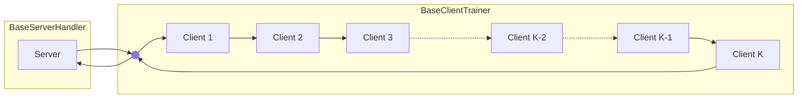
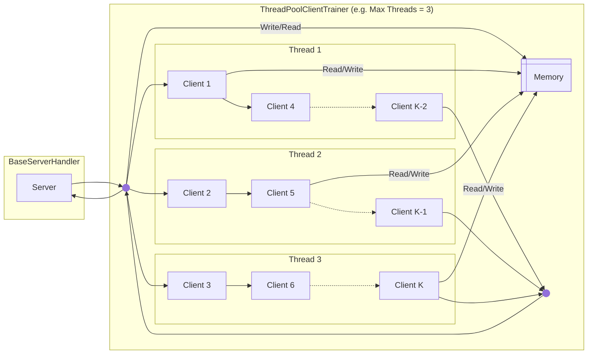
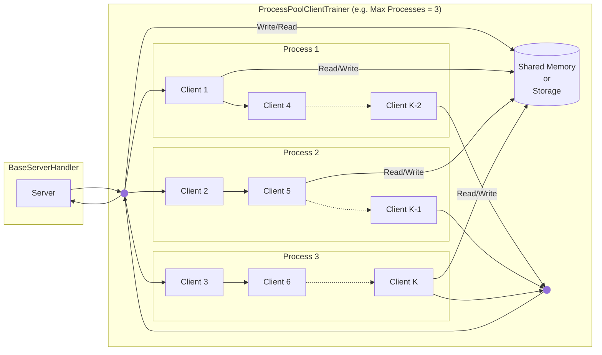

<div align="center"></div>
<div align="center">A blazing-fast, minimalist, and researcher-friendly simulation framework for Federated Learning</div>
<br>
<div align="center">
  <a href="https://github.com/astral-sh/uv"></a>
  <a href="https://pypi.python.org/pypi/blazefl"></a>
  <a href="https://pypi.python.org/pypi/blazefl"></a>
  <a href="https://pypi.python.org/pypi/blazefl"></a>
</div>


## Feature Highlights

- 🚀 **High Performance**: Optimized for single-node simulations, BlazeFL allows you to adjust the degree of parallelism for efficient resource management. 

- 🧩 **High Extensibility**: BlazeFL focuses on core communication and parallelization interfaces, avoiding excessive abstraction to maintain flexibility. 

- 🍃 **Minimal Dependencies**: The framework's core relies only on [PyTorch](https://github.com/pytorch/pytorch), ensuring a lightweight and straightforward setup. 

- 🔄 **Robust Reproducibility**: Utilities for saving and restoring seed states are provided to ensure consistent results, even in multi-process and multi-threaded environments.

- 🛡️ **Structured and Type-Safe by Design**: By leveraging [dataclasses](https://docs.python.org/3/library/dataclasses.html) and [protocols](https://typing.python.org/en/latest/spec/protocol.html), BlazeFL enables the creation of clear, type-safe, and self-documenting communication packages (`UplinkPackage`, `DownlinkPackage`). This design enhances code readability, maintainability, and reduces errors in FL workflows.

## Execution Modes

BlazeFL offers three distinct execution modes, each providing a different balance between implementation simplicity and performance.

### 1. Single-Threaded Mode

**Executes clients sequentially in a single thread.**

This is the most straightforward mode, making it ideal for simple simulations or debugging, though it offers the lowest throughput. This mode is implemented using the `BaseClientTrainer` class.



### 2. Multi-Threaded Mode (Experimental)

**Leverages multiple threads to process clients in parallel within the same process.**

This mode, implemented via the `ThreadPoolClientTrainer` class, can offer faster performance while maintaining a simpler implementation than multi-processing.

> [!IMPORTANT]
> To achieve true parallelism, this mode requires [Python 3.13+ with the experimental free-threading build](https://docs.python.org/3/howto/free-threading-python.html) enabled. Without it, performance will be limited by the Global Interpreter Lock (GIL), resulting in concurrency rather than true parallelism.



### 3. Multi-Process Mode

**Utilizes separate processes to achieve true parallelism and robust resource isolation.**

This production-ready mode, corresponding to the `ProcessPoolClientTrainer` class, offers excellent performance. It provides two options for Inter-Process Communication (IPC), configurable via the `ipc_mode` parameter, to suit your needs:
- **Storage Mode**: Shares parameters via disk, reducing memory usage.
- **Shared Memory Mode**: Shares parameters directly in shared memory for potentially faster performance.



## Getting Started

### Installation

BlazeFL is available on PyPI and can be installed using your preferred package manager.

For example, using [uv](https://docs.astral.sh/uv/getting-started/installation/):

```bash
uv add blazefl
```

### Examples

| Example | Description | 
|---------|-------------|
| [Quickstart: FedAvg](https://github.com/kitsuyaazuma/blazefl/tree/main/examples/quickstart-fedavg) | Learn the fundamentals of BlazeFL with a standard Federated Averaging (FedAvg) implementation, covering both **single-threaded** and **multi-process** modes. |
| [Experimental: Multi-Threaded FedAvg](https://github.com/kitsuyaazuma/blazefl/tree/main/examples/experimental-freethreaded) | Explore high-performance parallel training with a **multi-threaded** FedAvg, leveraging Python 3.13+'s experimental free-threading mode. | 
| [Step-by-Step Tutorial: DS-FL](https://github.com/kitsuyaazuma/blazefl/tree/main/examples/step-by-step-dsfl) | Build a custom distillation-based Federated Learning algorithm from scratch, and understand how to implement your own algorithms on the BlazeFL framework. |


## Robust Reproducibility
BlazeFL provides two strategies to ensure the reproducibility of your experiments, especially in complex scenarios like multi-process or multi-threaded environments. To use these features, please install the required dependencies:

```bash
uv add blazefl[reproducibility]
```

### 1. Global Seeding Strategy

This is a simpler approach that uses the `seed_everything` function to set a global seed. 
With this strategy, each child process is responsible for capturing and restoring a `RandomStateSnapshot`, which holds the states of random number generators for libraries like Python's random, NumPy, and PyTorch.

This strategy works effectively with `ProcessPoolClientTrainer`, where each process has its own independent memory space. However, it is **not compatible** with `ThreadPoolClientTrainer`. Because all threads share a single global random number generator, the order of random number consumption becomes non-deterministic, making it impossible to guarantee reproducibility.

### 2. Generator-Based Strategy (Recommended)

This is the **recommended** approach in BlazeFL. It involves using the `create_rng_suite` function to create an `RNGSuite` object, which contains independent, seeded random number generators for each library (Python, NumPy, PyTorch). This avoids reliance on a global state and allows for independent random streams for each component, ensuring robust reproducibility even in parallelized simulations.

#### User Guide

When adopting the generator-based strategy, there's a crucial consideration. Libraries that internally rely on the global random number generator, such as `RandomCrop` or `RandomHorizontalFlip` from `torchvision.transforms`, will not benefit from the `RNGSuite` out of the box.

To resolve this, you must create a custom version of such transforms by inheriting from the original class and modifying it to accept and use a `torch.Generator` instance.

**Example Implementation:** `GeneratorRandomHorizontalFlip`

```python
import torch
from torchvision.transforms import RandomHorizontalFlip

class GeneratorRandomHorizontalFlip(RandomHorizontalFlip):
    def __init__(self, p=0.5, generator: torch.Generator | None = None):
        super().__init__(p)
        self.generator = generator

    def forward(self, img):
        if torch.rand(1, generator=self.generator) < self.p:
            return F.hflip(img)
        return img
```

By integrating these custom `Transform` classes into your dataset pipeline, you can achieve full reproducibility across all execution modes, including `ThreadPoolClientTrainer`.

## Simulation Benchmarks

To evaluate the performance of BlazeFL, we conducted a comparative benchmark against [Flower](https://github.com/adap/flower), a popular FL framework.

### Benchmark Setup

The benchmark was performed using the **FedAvg** algorithm on the **CIFAR-10** dataset. The simulation was configured with **100 clients**, **5 communication** rounds, and **5 local epochs** for two models: a small [CNN](https://pytorch.org/tutorials/beginner/blitz/cifar10_tutorial.html) and a large [ResNet18](https://pytorch.org/vision/main/models/generated/torchvision.models.resnet18.html).

### Execution Environment

The benchmark was conducted in the following Podman container environment:
- **CPU**: 12 CPU
- **Memory**: 85 GB
- **Shared Memory**: 32 GB
- **GPU**: 2 x NVIDIA RTX A6000

> [!NOTE]
> This benchmark was run in a container, and the resources are not completely isolated from other processes. Therefore, please consider these results as reference values. A more rigorous evaluation is planned to be conducted on a cloud VM in the future.

### Results

<div style="display: flex; justify-content: center; align-items: center;">
  
  
</div>
<br>

The benchmark results indicate that BlazeFL has competitive performance against Flower. This is noteworthy as BlazeFL achieves this with a significantly smaller codebase relying only on standard Python libraries and PyTorch, whereas Flower is a powerful framework built on top of Ray. In particular, the experimental multi-threaded mode shows the potential for even higher performance due to its lightweight threads.


## Contributing

We welcome contributions from the community! If you'd like to contribute to this project, please see our [contribution guidelines](https://github.com/kitsuyaazuma/blazefl/blob/main/docs/source/contribute.rst) for more information on how to get started.

Please note that this project is governed by our [Code of Conduct](https://github.com/kitsuyaazuma/blazefl/blob/main/CODE_OF_CONDUCT.md). By participating, you are expected to uphold this code.
