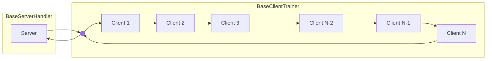
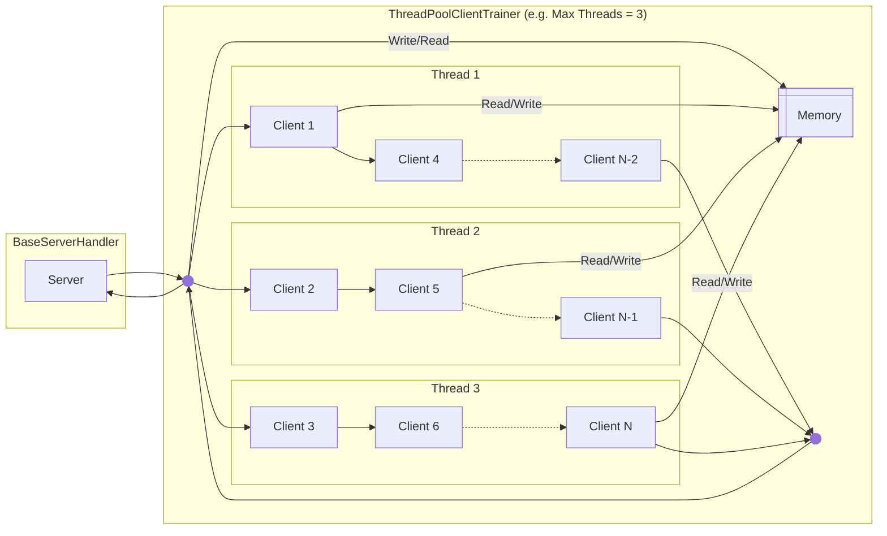
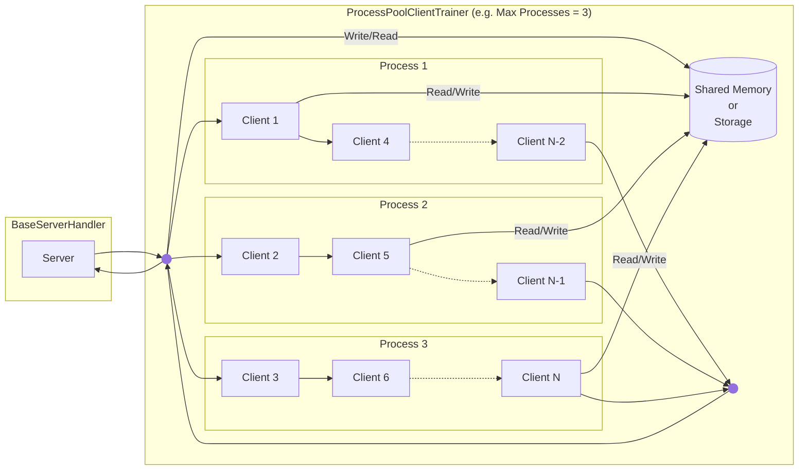

<div align="center"></div>
<div align="center">A blazing-fast, minimalist, and researcher-friendly simulation framework for Federated Learning</div>
<br>
<div align="center">
  <a href="https://github.com/astral-sh/uv"></a>
  <a href="https://pypi.python.org/pypi/blazefl"></a>
  <a href="https://pypi.python.org/pypi/blazefl"></a>
  <a href="https://pypi.python.org/pypi/blazefl"></a>
</div>


## Why Choose BlazeFL?

- 🚀 **High Performance**: Optimized for single-node simulations, BlazeFL allows you to adjust the degree of parallelism. For example, if you want to simulate 100 clients on a single node but lack the resources to run them all concurrently, you can configure 10 parallel processes to manage the simulation efficiently. 

- 🔧 **Extensibility**: BlazeFL provides interfaces solely for communication and parallelization, avoiding excessive abstraction. This design ensures that the framework remains flexible and adaptable to various use cases.

- 📦 **Minimal Dependencies**: Minimal Dependencies: The core components of BlazeFL rely only on [PyTorch](https://github.com/pytorch/pytorch), ensuring a lightweight and straightforward setup. 

- 🔄 **Robust Reproducibility**: Even in multi-process environments, BlazeFL offers utilities to save and restore seed states, ensuring consistent and reproducible results across simulations.

- 🏷️ **Type Hint Support**: The framework fully supports type hints, enhancing code readability and maintainability.

- 🔗 **Loose Compatibility with FedLab**: Inspired by [FedLab](https://github.com/SMILELab-FL/FedLab), BlazeFL maintains a degree of compatibility, facilitating an easy transition to production-level implementations when necessary.

## Execution Modes

BlazeFL offers three distinct execution modes, each providing a different balance between implementation simplicity and performance.

### 1. Single-Threaded Mode

**Executes clients sequentially in a single thread.**

This is the most straightforward mode, making it ideal for simple simulations or debugging, though it offers the lowest throughput. This mode is implemented using the `BaseClientTrainer` class.



### 2. Multi-Threaded Mode (Experimental)

**Leverages multiple threads to process clients in parallel within the same process.**

This mode, implemented via the `ThreadPoolClientTrainer` class, can offer faster performance while maintaining a simpler implementation than multi-processing.

> [!IMPORTANT]
> To achieve true parallelism, this mode requires [Python 3.13+ with the experimental free-threading build](https://docs.python.org/3/howto/free-threading-python.html) enabled. Without it, performance will be limited by the Global Interpreter Lock (GIL), resulting in concurrency rather than true parallelism.



### 3. Multi-Process Mode

**Utilizes separate processes to achieve true parallelism and robust resource isolation.**

This production-ready mode, corresponding to the `ProcessPoolClientTrainer` class, offers excellent performance. It provides two options for Inter-Process Communication (IPC), configurable via the `ipc_mode` parameter, to suit your needs:
- **Storage Mode**: Shares parameters via disk, reducing memory usage.
- **Shared Memory Mode**: Shares parameters directly in shared memory for potentially faster performance.



## Getting Started

### Installation

BlazeFL is available on PyPI and can be installed using your preferred package manager.

For example, using [uv](https://docs.astral.sh/uv/getting-started/installation/):

```bash
uv add blazefl
```

### Examples

| Example | Description | 
|---------|-------------|
| [Quickstart: FedAvg](https://github.com/kitsuyaazuma/blazefl/tree/main/examples/quickstart-fedavg) | Learn the fundamentals of BlazeFL with a standard Federated Averaging (FedAvg) implementation, covering both **single-threaded** and **multi-process** modes. |
| [Experimental: Multi-Threaded FedAvg](https://github.com/kitsuyaazuma/blazefl/tree/main/examples/experimental-freethreaded) | Explore high-performance parallel training with a **multi-threaded** FedAvg, leveraging Python 3.13+'s experimental free-threading mode. | 
| [Step-by-Step Tutorial: DS-FL](https://github.com/kitsuyaazuma/blazefl/tree/main/examples/step-by-step-dsfl) | Build a custom distillation-based Federated Learning algorithm from scratch, and understand how to implement your own algorithms on the BlazeFL framework. |

## FL Simulation Benchmarks

Benchmarks were conducted using Google Cloud’s Compute Engine with the following specifications:

<details>
<summary> Machine Configuration</summary>

- Machine Type: [a2-highgpu-1g](https://cloud.google.com/compute/docs/gpus#a2-standard) (vCPU count: 12, VM memory: 85 GB)
- CPU Platform: Intel Cascade Lake
- GPU: 1 x NVIDIA A100 40GB
- Boot Disk: 250 GB SSD
</details>


<details>
<summary> Benchmark Setup</summary>

- Algorithm: [FedAvg](https://proceedings.mlr.press/v54/mcmahan17a)
- Dataset: [CIFAR-10](https://www.cs.toronto.edu/~kriz/cifar.html)
- Number of Clients: 100
- Communication Rounds: 5
- Local Training: 5 epochs, Learning Rate: 0.1, Batch Size: 50
- Role
  -	Server: Aggregation
  -	Clients: Training and Evaluation (80% training, 20% evaluation)
- Models
  - [CNN](https://pytorch.org/tutorials/beginner/blitz/cifar10_tutorial.html) (size: 0.24 MB)
  - [ResNet18](https://pytorch.org/vision/main/models/generated/torchvision.models.resnet18.html) (size: 44.59 MB)

</details>

For benchmarking purposes, we utilized Flower’s [Quickstart Example](https://github.com/adap/flower/tree/main/examples/quickstart-pytorch) as a baseline to evaluate BlazeFL’s performance and efficiency.

<div style="display: flex; justify-content: center; align-items: center;">
  
  
</div>


## Contributing

We welcome contributions from the community! If you'd like to contribute to this project, please follow these guidelines:

### Issues

If you encounter a bug, have a feature request, or would like to suggest an improvement, please open an issue on the GitHub repository. Make sure to provide detailed information about the problem or suggestion.

### Pull Requests

We gladly accept pull requests! Before submitting a pull request, please ensure the following:

1. Fork the repository and create your branch from main.
2. Ensure your code adheres to the project's coding standards.
3. Test your changes thoroughly.
4. Make sure your commits are descriptive and well-documented.
5. Update the README and any relevant documentation if necessary.

### Code of Conduct

Please note that this project is governed by our [Code of Conduct](https://github.com/kitsuyaazuma/BlazeFL/blob/main/CODE_OF_CONDUCT.md). By participating, you are expected to uphold this code. Please report any unacceptable behavior.

Thank you for contributing to our project!
